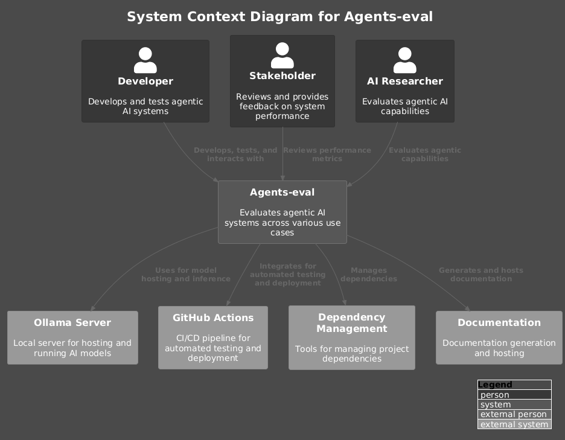
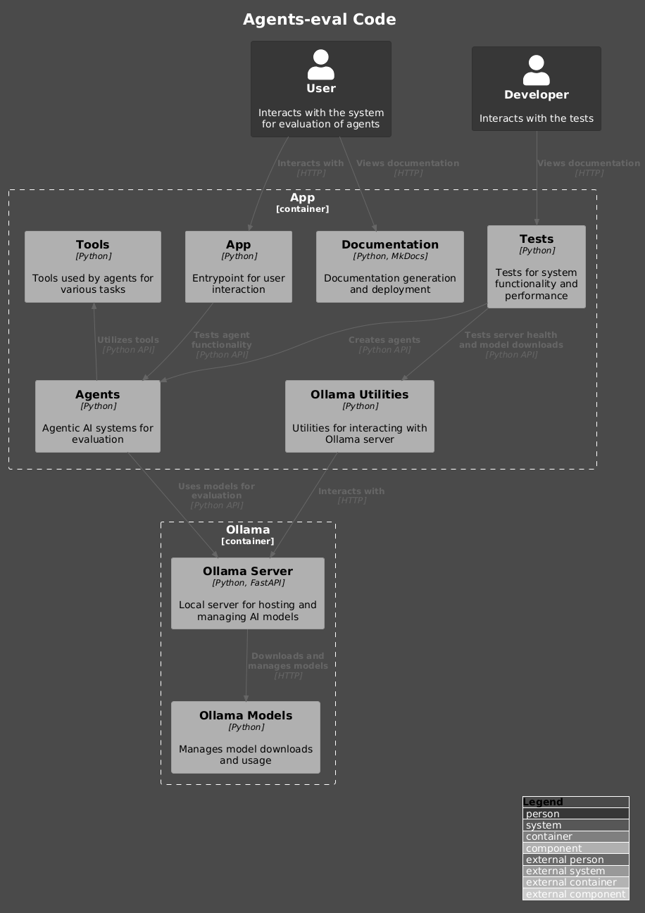

# Agents-eval

This project aims to implement an evaluation pipeline to assess the effectiveness of open-source agentic AI systems across various use cases, focusing on use case agnostic metrics that measure core capabilities such as task decomposition, tool integration, adaptability, and overall performance.


[](https://www.codefactor.io/repository/github/qte77/Agents-eval)
[](https://github.com/qte77/Agents-eval/actions/workflows/codeql.yaml)
[](https://github.com/qte77/Agents-eval/actions/workflows/ruff.yaml)
[](https://github.com/qte77/Agents-eval/actions/workflows/pytest.yaml)
[](https://github.com/qte77/Agents-eval/actions/workflows/links-fail-fast.yaml)
[](https://github.com/qte77/Agents-eval/actions/workflows/generate-deploy-mkdocs-ghpages.yaml)
[](https://vscode.dev/github/qte77/Agents-eval)

## Status

(DRAFT) (WIP) ----> Not fully implemented yet

For version history have a look at the [CHANGELOG](CHANGELOG.md).

## Setup

`make setup`

## Usage

`uv run python -m src`

## Testing

`make test` or `uv run pytest`

## Documentation

[Agents-eval](https://qte77.github.io/Agents-eval)

### Architecture




### Project Structure

```sh
#TODO
```

## TODO

### Project outline

`#TODO`

## Landscape overview

### Agentic System Frameworks

- [PydanticAI](https://github.com/pydantic/pydantic-ai)
- [smolAgents](https://github.com/huggingface/smolagents)
- [AutoGen](https://github.com/microsoft/autogen)
- [Semantic Kernel](https://github.com/microsoft/semantic-kernel)
- [CrewAI](https://github.com/crewAIInc/crewAI)
- [LangChain](https://github.com/langchain-ai/langchain)
- [Langflow](github.com/langflow-ai/langflow)

### Evaluation Tools and Frameworks

- Focusing on agentic systems
  - [Agentic Application Evaluation Framework (AAEF)](https://docs.raga.ai/ragaai-aaef-agentic-application-evaluation-framework)
  - [RagaAI-Catalyst](https://github.com/raga-ai-hub/RagaAI-Catalyst)
  - [Mosaic AI Agent Evaluation](https://docs.databricks.com/en/generative-ai/agent-evaluation/index.html)
  - [AutoGenBench](https://github.com/microsoft/autogen/blob/0.2/samples/tools/autogenbench)
  - [AgentNeo](https://github.com/raga-ai-hub/agentneo)
- More RAG oriented
  - [DeepEval](https://github.com/confident-ai/deepeval)
  - [RAGAs](https://github.com/explodinggradients/ragas)
- LLM apps
  - [MLFlow LLM Evaluate](https://mlflow.org/docs/latest/llms/llm-evaluate/index.html)

### Core Agentic Evaluation Metrics

- Task Decomposition and Planning
  - Structural Similarity Index (SSI)
  - Node F1 Score
- Tool Integration and Utilization
  - Tool F1 Score
  - Tool Utilisation Efficacy (TUE)
  - Tool Integration Effectiveness
- Memory and Context Management
  - Memory Coherence and Retrieval (MCR)
- System Adaptability and Learning Rate
- Automation Rate
- Overall System Performance
  - Task Success Rate
  - Latency and Efficiency (computational overhead)
  - Component Synergy Score (CSS)
  - Strategic Planning Index (SPI)
- LLM-as-a-judge, eval by LLM

### Possible Use Cases

- Financial Services
  - Automated Trading Strategies
  - Fraud Detection
- Supply Chain Management
  - Inventory Optimization
  - Demand Forecasting
- Customer Service
  - AI Chatbots
  - Virtual Assistants
- Intelligent Document Processing (IDP)
  - Contract Management
  - Financial Statement Processing
  - Insurance Claims Processing
- Healthcare
  - Treatment planning
  - Drug discovery
- Image Processing
  - Medical Imaging
  - Object Detection
  - Image Classification

## Further Reading

- [Advancing Agentic Systems: Dynamic Task Decomposition, Tool Integration and Evaluation using Novel Metrics and Dataset](https://arxiv.org/abs/2410.22457)
