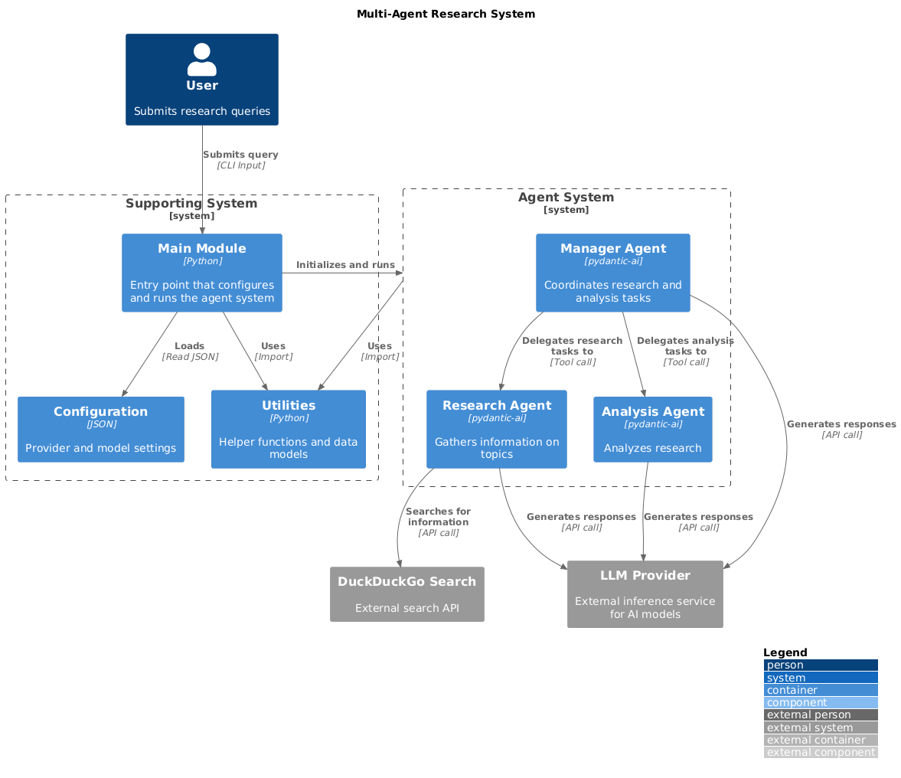

# Agents-eval

This project aims to implement an evaluation pipeline to assess the effectiveness of open-source agentic AI systems across various use cases, focusing on use case agnostic metrics that measure core capabilities such as task decomposition, tool integration, adaptability, and overall performance.


[](https://www.codefactor.io/repository/github/qte77/Agents-eval)
[](https://github.com/qte77/Agents-eval/actions/workflows/codeql.yaml)
[](https://github.com/qte77/Agents-eval/actions/workflows/ruff.yaml)
[](https://github.com/qte77/Agents-eval/actions/workflows/pytest.yaml)
[](https://github.com/qte77/Agents-eval/actions/workflows/links-fail-fast.yaml)
[](https://github.com/qte77/Agents-eval/actions/workflows/generate-deploy-mkdocs-ghpages.yaml)
[](https://vscode.dev/github/qte77/Agents-eval)

## Status

(DRAFT) (WIP) ----> Not fully implemented yet

For version history have a look at the [CHANGELOG](CHANGELOG.md).

## Setup and Usage

- `make setup_env`
- `make run_cli`
- `make run_gui`
- `make test_all`

## Configuration

[config.json](./src/config.json) contains . Inference endpoints used should adhere to [OpenAI Model Spec 2024-05-08](https://cdn.openai.com/spec/model-spec-2024-05-08.html) which is used by [pydantic-ai OpenAI-compatible Models](https://ai.pydantic.dev/models/#openai-compatible-models).

## Environment

[.env.example](./.env.example) contains example for usage of API keys and variables.

```text
# inference EP
GEMINI_API_KEY="xyz"

# tools
TAVILY_API_KEY=""

# log/mon/trace
WANDB_API_KEY="xyz"
```

## Documentation

[Agents-eval](https://qte77.github.io/Agents-eval)

### Project outline

`#TODO`

#### Metrics used

`#TODO`

#### Tools used

`#TODO`

### Architecture



### Project Structure

```sh
#TODO
```

## Landscape overview

### Agentic System Frameworks

- [PydanticAI](https://github.com/pydantic/pydantic-ai)
- [restack](https://www.restack.io/)
- [smolAgents](https://github.com/huggingface/smolagents)
- [AutoGen](https://github.com/microsoft/autogen)
- [Semantic Kernel](https://github.com/microsoft/semantic-kernel)
- [CrewAI](https://github.com/crewAIInc/crewAI)
- [Langchain](https://github.com/langchain-ai/langchain)
- [Langflow](github.com/langflow-ai/langflow)

### Agent-builder

- [Archon](https://github.com/coleam00/Archon)
- [Agentstack](https://github.com/AgentOps-AI/AgentStack)

### Evaluation

- Focusing on agentic systems
  - [AgentNeo](https://github.com/raga-ai-hub/agentneo)
  - [AutoGenBench](https://github.com/microsoft/autogen/blob/0.2/samples/tools/autogenbench)
  - [Langchain AgentEvals](https://github.com/langchain-ai/agentevals)
  - [Mosaic AI Agent Evaluation](https://docs.databricks.com/en/generative-ai/agent-evaluation/index.html)
  - [RagaAI-Catalyst](https://github.com/raga-ai-hub/RagaAI-Catalyst)
- RAG oriented
  - [RAGAs](https://github.com/explodinggradients/ragas)
- LLM apps
  - [DeepEval](https://github.com/confident-ai/deepeval)
  - [Langchain OpenEvals](https://github.com/langchain-ai/openevals)
  - [MLFlow LLM Evaluate](https://mlflow.org/docs/latest/llms/llm-evaluate/index.html)

### Observation, Monitoring, Tracing

- [AgentOps - Agency](https://www.agentops.ai/)
- [arize](https://arize.com/)
- [Langtrace](https://www.langtrace.ai/)
- [LangSmith - Langchain](https://www.langchain.com/langsmith)
- [Weave - Weights & Biases](https://wandb.ai/site/weave/)

### Benchmarks

- [AgentEvals CORE-Bench Leaderboard](https://huggingface.co/spaces/agent-evals/core_leaderboard)
- [Berkeley Function-Calling Leaderboard](https://gorilla.cs.berkeley.edu/leaderboard.html)
- [Chatbot Arena LLM Leaderboard](https://lmsys.org/projects/)
- [GAIA Leaderboard](https://gaia-benchmark-leaderboard.hf.space/)
- [GalileoAI Agent Leaderboard](https://huggingface.co/spaces/galileo-ai/agent-leaderboard)
- [WebDev Arena Leaderboard](https://web.lmarena.ai/leaderboard)

## Further Reading

- [[2503.13657] Why Do Multi-Agent LLM Systems Fail?](https://arxiv.org/abs/2503.13657)
- [[2502.14776] SurveyX: Academic Survey Automation via Large Language Models](https://arxiv.org/abs/2502.14776)
- [[2502.05957] AutoAgent: A Fully-Automated and Zero-Code Framework for LLM Agents](https://arxiv.org/abs/2502.05957)
- [[2501.16150] AI Agents for Computer Use: A Review of Instruction-based Computer Control, GUI Automation, and Operator Assistants](https://arxiv.org/abs/2501.16150)
- [[2501.06590] ChemAgent](https://arxiv.org/abs/2501.06590)
- [[2501.04227] Agent Laboratory: Using LLM Agents as Research Assitants](https://arxiv.org/abs/2501.04227)
- [[2412.04093] Practical Considerations for Agentic LLM Systems](https://arxiv.org/abs/2412.04093)
- [[2411.13768] Evaluation-driven Approach to LLM Agents](https://arxiv.org/abs/2411.13768)
- [[2411.10478] Large Language Models for Constructing and Optimizing Machine Learning Workflows: A Survey](https://arxiv.org/abs/2411.10478)
- [[2411.05285] A taxonomy of agentops for enabling observability of foundation model based agents](https://arxiv.org/abs/2411.05285)
- [[2410.22457] Advancing Agentic Systems: Dynamic Task Decomposition, Tool Integration and Evaluation using Novel Metrics and Dataset](https://arxiv.org/abs/2410.22457)
- [[2408.06361] Large Language Model Agent in Financial Trading: A Survey](https://arxiv.org/abs/2408.06361)
- [[2404.13501] A Survey on the Memory Mechanism of Large Language Model based Agents](https://arxiv.org/pdf/2404.13501)
- [[2402.02716] Understanding the planning of LLM agents: A survey](https://arxiv.org/abs/2402.02716)
- [[2402.01030] Executable Code Actions Elicit Better LLM Agents](https://arxiv.org/abs/2402.01030)
- [[2308.11432] A Survey on Large Language Model based Autonomous Agents](https://arxiv.org/abs/2308.11432)
