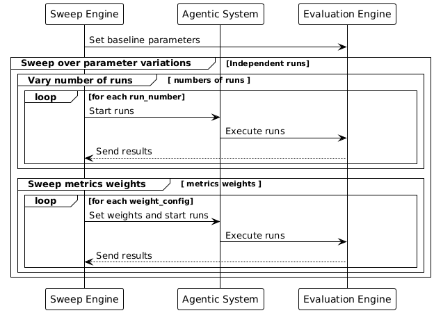

# Agents-eval

This project aims to implement an evaluation pipeline to assess the effectiveness of open-source agentic AI systems across various use cases, focusing on use case agnostic metrics that measure core capabilities such as task decomposition, tool integration, adaptability, and overall performance.


[](https://github.com/qte77/Agents-eval/actions/workflows/codeql.yaml)
[](https://www.codefactor.io/repository/github/qte77/Agents-eval)
[](https://github.com/qte77/Agents-eval/actions/workflows/ruff.yaml)
[](https://github.com/qte77/Agents-eval/actions/workflows/pytest.yaml)
[](https://github.com/qte77/Agents-eval/actions/workflows/links-fail-fast.yaml)
[](https://github.com/qte77/Agents-eval/actions/workflows/generate-deploy-mkdocs-ghpages.yaml)

**DevEx** [](https://vscode.dev/github/qte77/Agents-eval)
[](https://github.com/codespaces/new?repo=qte77/Agents-eval&devcontainer_path=.devcontainer/setup_dev/devcontainer.json)
[](https://github.com/codespaces/new?repo=qte77/Agents-eval&devcontainer_path=.devcontainer/setup_dev_claude/devcontainer.json)
[](https://github.com/codespaces/new?repo=qte77/Agents-eval&devcontainer_path=.devcontainer/setup_dev_ollama/devcontainer.json)
[](https://talktogithub.com/qte77/Agents-eval)
[](https://github.com/qte77/Agents-eval)
[](https://gittodoc.com/qte77/Agents-eval)

## Status

(DRAFT) (WIP) ----> Not fully implemented yet

For version history have a look at the [CHANGELOG](CHANGELOG.md).

## Setup and Usage

- `make setup_prod`
- `make setup_dev` or `make setup_dev_claude` or `make setup_dev_ollama`
- `make run_cli` or `make run_cli ARGS="--help"`
- `make run_gui`
- `make test_all`

### Configuration

- [config_app.py](src/app/config/config_app.py) contains configuration constants for the application.
- [config_chat.json](src/app/config/config_chat.json) contains inference provider configuration and prompts. inference endpoints used should adhere to [OpenAI Model Spec 2024-05-08](https://cdn.openai.com/spec/model-spec-2024-05-08.html) which is used by [pydantic-ai OpenAI-compatible Models](https://ai.pydantic.dev/models/#openai-compatible-models).
- [config_eval.json](src/app/config/config_eval.json) contains evaluation metrics and their weights.
- [data_models.py](src/app/config/data_models.py) contains the pydantic data models for agent system configuration and results.

### Environment

[.env.example](.env.example) contains examples for usage of API keys and variables.

```text
# inference EP
GEMINI_API_KEY="xyz"

# tools
TAVILY_API_KEY=""

# log/mon/trace
WANDB_API_KEY="xyz"
```

### Customer Journey and User Story

Have a look at the [example user story](docs/UserStory.md).

<details>
  <summary>Show Customer Journey</summary>
  
  
</details>

### Note

1. The contained chat configuration uses free inference endpoints which are subject to change by the providers. See lists such as [free-llm-api-resources](https://github.com/cheahjs/free-llm-api-resources) to find other providers.
2. The contained chat configuration uses models which are also subject to change by the providers and have to be updated from time to time.
3. LLM-as-judge is also subject to the chat configuration.

## Documentation

[Agents-eval](https://qte77.github.io/Agents-eval)

### Project Outline

`# TODO`

### Agents

#### Manager Agent

- **Description**: Oversees research and analysis tasks, coordinating the efforts of the research, analysis, and synthesizer agents to provide comprehensive answers to user queries. Delegates tasks and ensures the accuracy of the information.
- **Responsibilities**:
  - Coordinates the research, analysis, and synthesis agents.
  - Delegates research tasks to the Research Agent.
  - Delegates analysis tasks to the Analysis Agent.
  - Delegates synthesis tasks to the Synthesizer Agent.
  - Ensures the accuracy of the information.
- **Location**: [src/app/agents/agent_system.py](https://github.com/qte77/Agents-eval/blob/main/src/app/agents/agent_system.py)

#### Researcher Agent

- **Description**: Gathers and analyzes data relevant to a given topic, utilizing search tools to collect data and verifying the accuracy of assumptions, facts, and conclusions.
- **Responsibilities**:
  - Gathers and analyzes data relevant to the topic.
  - Uses search tools to collect data.
  - Checks the accuracy of assumptions, facts, and conclusions.
- **Tools**:
  - [DuckDuckGo Search Tool](https://ai.pydantic.dev/common-tools/#duckduckgo-search-tool)
- **Location**: [src/app/agents/agent_system.py](https://github.com/qte77/Agents-eval/blob/main/src/app/agents/agent_system.py)

#### Analyst Agent

- **Description**: Checks the accuracy of assumptions, facts, and conclusions in the provided data, providing relevant feedback and ensuring data integrity.
- **Responsibilities**:
  - Checks the accuracy of assumptions, facts, and conclusions.
  - Provides relevant feedback if the result is not approved.
  - Ensures data integrity.
- **Location**: [src/app/agents/agent_system.py](https://github.com/qte77/Agents-eval/blob/main/src/app/agents/agent_system.py)

#### Synthesizer Agent

- **Description**: Outputs a well-formatted scientific report using the data provided, maintaining the original facts, conclusions, and sources.
- **Responsibilities**:
  - Outputs a well-formatted scientific report using the provided data.
  - Maintains the original facts, conclusions, and sources.
- **Location**: [src/app/agents/agent_system.py](https://github.com/qte77/Agents-eval/blob/main/src/app/agents/agent_system.py)

### Datasets used

`# TODO`

### LLM-as-a-Judge

`# TODO`

### Custom Evaluations Metrics Baseline

As configured in [config_eval.json](src/app/config/config_eval.json).

```json
{
    "evaluators_and_weights": {
        "planning_rational": "1/6",
        "task_success": "1/6",
        "tool_efficiency": "1/6",
        "coordination_quality": "1/6",
        "time_taken": "1/6",
        "text_similarity": "1/6"
    }
}
```

### Eval Metrics Sweep

<details>
  <summary>Eval Metrics Sweep</summary>
  
</details>

### Tools available

Other pydantic-ai agents and [pydantic-ai DuckDuckGo Search Tool](https://ai.pydantic.dev/common-tools/#duckduckgo-search-tool).

### Agentic System Architecture

<details>
  <summary>Show Agentic System Architecture</summary>
  
  
</details>

### Project Repo Structure

```sh
|- .claude  # claude code config and commands
|- .devcontainer  # pre-configured dev env
|- .github  # workflows
|- .streamlit  # config.toml
|- .vscode  # extensions, settings
|- assets/images
|- docs
|- src  # source code
   |- app
      |- agents
      |- config
      |- evals
      |- utils
      |- __init__.py
      |- main.py
      \- py.typed
   |- examples
   |- gui
   \- run_gui.py
|- tests
|- .env.example  # example env vars
|- .gitignore
|- .gitmessage
|- AGENTS.md  # common file adhering to agentsmd.com
|- CHANGEOG.md  # short project history
|- CLAUDE.md  # points to AGENTS.md
|- Dockerfile  # create app image
|- LICENSE.md
|- Makefile  # helper scripts
|- mkdocs.yaml  # docu from docstrings
|- pyproject.toml  # project settings
|- README.md  # project description
\- uv.lock  # resolved package versions
```

## Landscape overview

### Agentic System Frameworks

- [PydanticAI](https://github.com/pydantic/pydantic-ai)
- [restack](https://www.restack.io/)
- [smolAgents](https://github.com/huggingface/smolagents)
- [AutoGen](https://github.com/microsoft/autogen)
- [Semantic Kernel](https://github.com/microsoft/semantic-kernel)
- [CrewAI](https://github.com/crewAIInc/crewAI)
- [Langchain](https://github.com/langchain-ai/langchain)
- [Langflow](https://github.com/langflow-ai/langflow)

### Agent-builder

- [Archon](https://github.com/coleam00/Archon)
- [Agentstack](https://github.com/AgentOps-AI/AgentStack)

### Evaluation

- Focusing on agentic systems
  - [AgentNeo](https://github.com/raga-ai-hub/agentneo)
  - [AutoGenBench](https://github.com/microsoft/autogen/blob/0.2/samples/tools/autogenbench)
  - [Langchain AgentEvals](https://github.com/langchain-ai/agentevals)
  - [Mosaic AI Agent Evaluation](https://docs.databricks.com/en/generative-ai/agent-evaluation/index.html)
  - [RagaAI-Catalyst](https://github.com/raga-ai-hub/RagaAI-Catalyst)
  - [AgentBench](https://github.com/THUDM/AgentBench)
- RAG oriented
  - [RAGAs](https://github.com/explodinggradients/ragas)
- LLM apps
  - [DeepEval](https://github.com/confident-ai/deepeval)
  - [Langchain OpenEvals](https://github.com/langchain-ai/openevals)
  - [MLFlow LLM Evaluate](https://mlflow.org/docs/latest/llms/llm-evaluate/index.html)
  - [DeepEval (DeepSeek)]( github.com/confident-ai/deepeval)

### Observation, Monitoring, Tracing

- [AgentOps - Agency](https://www.agentops.ai/)
- [arize](https://arize.com/)
- [Langtrace](https://www.langtrace.ai/)
- [LangSmith - Langchain](https://www.langchain.com/langsmith)
- [Weave - Weights & Biases](https://wandb.ai/site/weave/)
- [Pydantic- Logfire](https://pydantic.dev/logfire)
- [comet Opik](https://github.com/comet-ml/opik)

### Datasets

- [awesome-reasoning - Collection of datasets](https://github.com/neurallambda/awesome-reasoning)

#### Scientific

- [SWIF2T](https://arxiv.org/abs/2405.20477), Automated Focused Feedback Generation for Scientific Writing Assistance, 2024, 300 peer reviews citing weaknesses in scientific papers and conduct human evaluation
- [PeerRead](https://github.com/allenai/PeerRead), A Dataset of Peer Reviews (PeerRead): Collection, Insights and NLP Applications, 2018, 14K paper drafts and the corresponding accept/reject decisions, over 10K textual peer reviews written by experts for a subset of the papers, structured JSONL, clear labels, See [A Dataset of Peer Reviews (PeerRead):Collection, Insights and NLP Applications](https://arxiv.org/pdf/1804.09635)
- [BigSurvey](https://www.ijcai.org/proceedings/2022/0591.pdf), Generating a Structured Summary of Numerous Academic Papers: Dataset and Method, 2022, 7K survey papers and 430K referenced papers abstracts
- [SciXGen](https://arxiv.org/abs/2110.10774), A Scientific Paper Dataset for Context-Aware Text Generation, 2021, 205k papers
- [scientific_papers](https://huggingface.co/datasets/armanc/scientific_papers), 2018, two sets of long and structured documents, obtained from ArXiv and PubMed OpenAccess, 300k+ papers, total disk 7GB

#### Reasoning, Deduction, Commonsense, Logic

- [LIAR](https://www.cs.ucsb.edu/~william/data/liar_dataset.zip), fake news detection, only 12.8k records, single label
- [X-Fact](https://github.com/utahnlp/x-fact/), Benchmark Dataset for Multilingual Fact Checking, 31.1k records, large, multilingual
- [MultiFC](https://www.copenlu.com/publication/2019_emnlp_augenstein/), A Real-World Multi-Domain Dataset for Evidence-Based Fact Checking of Claims, 34.9k records
- [FEVER](https://fever.ai/dataset/fever.html), Fact Extraction and VERification, 185.4k records
- TODO GSM8K, bAbI, CommonsenseQA, DROP, LogiQA, MNLI

#### Planning, Execution

- [Plancraft](https://arxiv.org/abs/2412.21033), an evaluation dataset for planning with LLM agents, both a text-only and multi-modal interface
- [IDAT](https://arxiv.org/abs/2407.08898), A Multi-Modal Dataset and Toolkit for Building and Evaluating Interactive Task-Solving Agents
- [PDEBench](https://github.com/pdebench/PDEBench), set of benchmarks for scientific machine learning
- [MatSci-NLP](https://arxiv.org/abs/2305.08264), evaluating the performance of natural language processing (NLP) models on materials science text
- TODO BigBench Hard, FSM Game

#### Tool Use, Function Invocation

- [Trelis Function Calling](https://huggingface.co/datasets/Trelis/function_calling_v3)
- [KnowLM Tool](https://huggingface.co/datasets/zjunlp/KnowLM-Tool)
- [StatLLM](https://arxiv.org/abs/2502.17657), statistical analysis tasks, LLM-generated SAS code, and human evaluation scores
- TODO ToolComp

### Benchmarks

- [SciArena: A New Platform for Evaluating Foundation Models in Scientific Literature Tasks](https://allenai.org/blog/sciarena)
- [AgentEvals CORE-Bench Leaderboard](https://huggingface.co/spaces/agent-evals/core_leaderboard)
- [Berkeley Function-Calling Leaderboard](https://gorilla.cs.berkeley.edu/leaderboard.html)
- [Chatbot Arena LLM Leaderboard](https://lmsys.org/projects/)
- [GAIA Leaderboard](https://gaia-benchmark-leaderboard.hf.space/)
- [GalileoAI Agent Leaderboard](https://huggingface.co/spaces/galileo-ai/agent-leaderboard)
- [WebDev Arena Leaderboard](https://web.lmarena.ai/leaderboard)
- [MiniWoB++: a web interaction benchmark for reinforcement learning](https://miniwob.farama.org/)

### Research Agents

- [Ai2 Scholar QA](https://qa.allen.ai/chat)

## Further Reading

- [[2506.18096] Deep Research Agents: A Systematic Examination And Roadmap](https://arxiv.org/abs/2506.18096), [gh / ai-agents-2030 / awesome-deep-research-agent](https://github.com/ai-agents-2030/awesome-deep-research-agent)
- [[2504.19678] From LLM Reasoning to Autonomous AI Agents: A Comprehensive Review](https://arxiv.org/abs/2504.19678)
- [[2503.21460] Large Language Model Agent: A Survey on Methodology, Applications and Challenges](https://arxiv.org/abs/2503.21460)
- [[2503.16416] Survey on Evaluation of LLM-based Agents](https://arxiv.org/abs/2503.16416)
- [[2503.13657] Why Do Multi-Agent LLM Systems Fail?](https://arxiv.org/abs/2503.13657)
- [[2502.14776] SurveyX: Academic Survey Automation via Large Language Models](https://arxiv.org/abs/2502.14776)
- [[2502.05957] AutoAgent: A Fully-Automated and Zero-Code Framework for LLM Agents](https://arxiv.org/abs/2502.05957)
- [[2502.02649] Fully Autonomous AI Agents Should Not be Developed](https://arxiv.org/abs/2502.02649)
- [[2501.16150] AI Agents for Computer Use: A Review of Instruction-based Computer Control, GUI Automation, and Operator Assistants](https://arxiv.org/abs/2501.16150)
- [[2501.06590] ChemAgent](https://arxiv.org/abs/2501.06590)
- [[2501.06322] Multi-Agent Collaboration Mechanisms: A Survey of LLMs](https://arxiv.org/abs/2501.06322)
- [[2501.04227] Agent Laboratory: Using LLM Agents as Research Assitants](https://arxiv.org/abs/2501.04227), [AgentRxiv:Towards Collaborative Autonomous Research](https://agentrxiv.github.io/)
- [[2501.00881] Agentic Systems: A Guide to Transforming Industries with Vertical AI Agents](https://arxiv.org/abs/2501.00881)
- [[2412.04093] Practical Considerations for Agentic LLM Systems](https://arxiv.org/abs/2412.04093)
- [[2411.13768] Evaluation-driven Approach to LLM Agents](https://arxiv.org/abs/2411.13768)
- [[2411.10478] Large Language Models for Constructing and Optimizing Machine Learning Workflows: A Survey](https://arxiv.org/abs/2411.10478)
- [[2411.05285] A taxonomy of agentops for enabling observability of foundation model based agents](https://arxiv.org/abs/2411.05285)
- [[2410.22457] Advancing Agentic Systems: Dynamic Task Decomposition, Tool Integration and Evaluation using Novel Metrics and Dataset](https://arxiv.org/abs/2410.22457)
- [[2408.06361] Large Language Model Agent in Financial Trading: A Survey](https://arxiv.org/abs/2408.06361)
- [[2408.06292] The AI Scientist: Towards Fully Automated Open-Ended Scientific Discovery](https://arxiv.org/abs/2408.06292)
- [[2404.13501] A Survey on the Memory Mechanism of Large Language Model based Agents](https://arxiv.org/pdf/2404.13501)
- [[2402.06360] CoSearchAgent: A Lightweight Collaborative Search Agent with Large Language Models](https://arxiv.org/abs/2402.06360)
- [[2402.02716] Understanding the planning of LLM agents: A survey](https://arxiv.org/abs/2402.02716)
- [[2402.01030] Executable Code Actions Elicit Better LLM Agents](https://arxiv.org/abs/2402.01030)
- [[2308.11432] A Survey on Large Language Model based Autonomous Agents](https://arxiv.org/abs/2308.11432)
